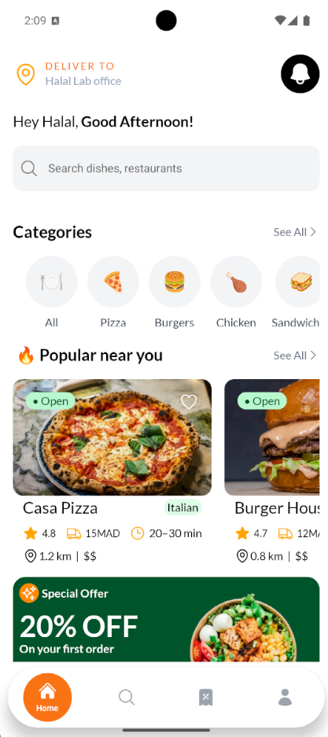
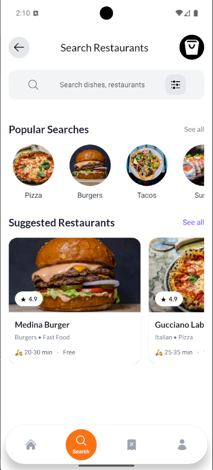
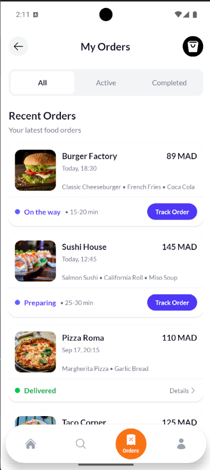
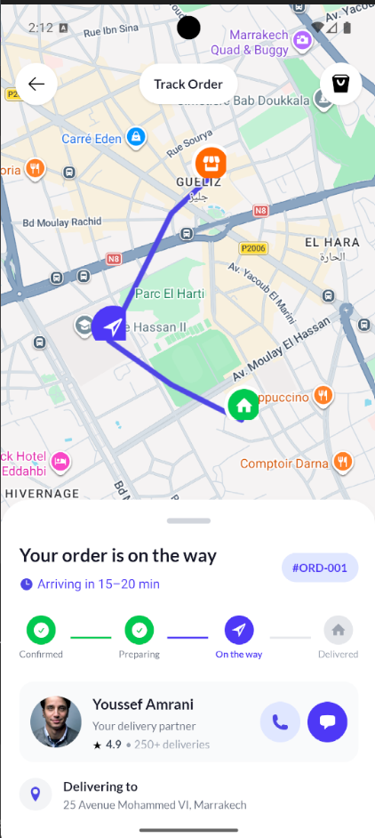
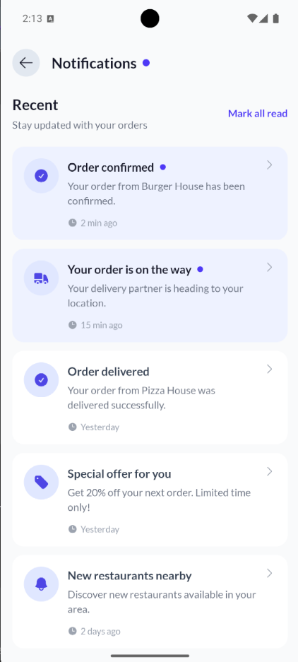
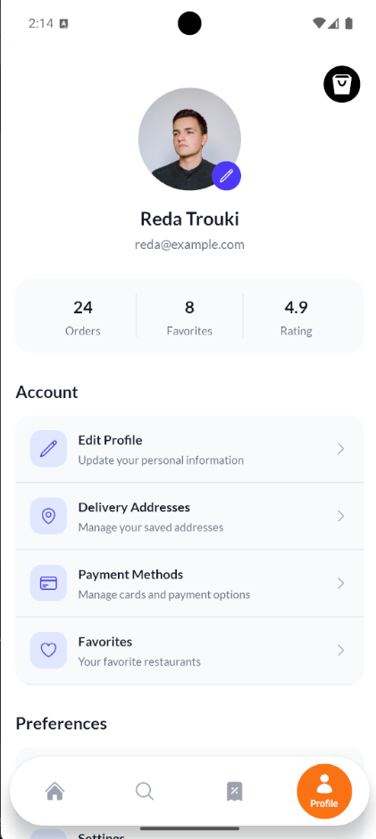

# 🍔 Food Delivery App

A modern and responsive **food delivery mobile application** built with **React Native and Expo**. The app provides a clean and intuitive experience for discovering restaurants, browsing food, placing orders, and tracking deliveries.
## 📱 App Screenshots

### 🏠 Home & Discovery

<p align="center">
  
  
  <!--  -->
</p>

### 🍔 Food & Ordering

<p align="center">
  <!--  -->
  <!--  -->
</p>

### 📦 Orders & Delivery

<p align="center">
  
  
  
</p>

### 👤 Profile

<p align="center">
  
</p>


## ✨ Features

* 🏠 **Home** — Discover restaurants, categories, and popular dishes
* 🔎 **Search** — Search for restaurants and food
* 🍕 **Food Categories** — Browse food by category
* 🏪 **Restaurants** — View available and recommended restaurants
* 🛒 **Cart** — Manage selected food items before ordering
* 📦 **Orders** — View current and previous orders
* 🚴 **Order Tracking** — Track an active delivery
* 🔔 **Notifications** — Receive updates about orders and promotions
* 👤 **Profile** — Manage user information and preferences
* 🌙 **Modern UI** — Clean interface with reusable components and consistent styling

## 🛠️ Tech Stack

* **React Native**
* **Expo**
* **TypeScript**
* **Expo Router**
* **NativeWind**
* **React Native Heroicons**
* **Expo Vector Icons**
* **React Native Safe Area Context**

## 📱 Screens

The application includes:

* Welcome / Authentication
* Home
* Search
* Restaurant listing
* Food categories
* Restaurant details
* Food details
* Cart
* Checkout
* Orders
* Order tracking
* Notifications
* Profile

## 📂 Project Structure

```text
app/
├── (auth)/
│   ├── login.tsx
│   └── register.tsx
│
├── (tabs)/
│   ├── home.tsx
│   ├── orders.tsx
│   ├── profile.tsx
│   ├── search.tsx
│   ├── _layout.tsx
│
├── track-order.tsx
├── notifications.tsx
└── _layout.tsx

components/
├── ...
│
data/
├── orders.ts
├── restaurants.ts
├── categories.ts
└── ...
```

The project uses **Expo Router file-based routing**, making navigation and screen organization easier to maintain.

## 🚀 Getting Started

### 1. Clone the repository

```bash
git clone https://github.com/your-username/your-repository.git

cd your-repository
```

### 2. Install dependencies

```bash
npm install
```

### 3. Start the development server

```bash
npx expo start
```

You can then open the application using:

* **Android Emulator**
* **iOS Simulator**
* **Expo Go**
* **Development Build**

## 📱 Running on Android

Start the development server:

```bash
npx expo start
```

Then press:

```text
a
```

to launch the application on an Android emulator.

## 🍎 Running on iOS

On macOS with Xcode installed:

```bash
npx expo start
```

Then press:

```text
i
```

to launch the application in the iOS Simulator.

## 🎨 UI & Design

The application follows a modern food-delivery design approach with:

* Rounded cards
* Clear visual hierarchy
* Consistent spacing
* Indigo-based accent colors
* Lato typography
* Food imagery
* Bottom tab navigation
* Interactive order states
* Mobile-first layouts

The goal is to provide a smooth experience from **discovering food → selecting a restaurant → ordering → tracking delivery**.

## 🧭 Navigation

The application uses **Expo Router** with file-based navigation.

Example:

```tsx
import { router } from "expo-router"

router.push("/orders")
```

Navigate to the order tracking screen:

```tsx
router.push("/track-order")
```

Navigate back:

```tsx
router.back()
```

## 📦 Available Scripts

```bash
# Start Expo development server
npx expo start

# Start with cleared cache
npx expo start -c

# Run Android
npx expo start --android

# Run iOS
npx expo start --ios

# Reset the starter project
npm run reset-project
```

## 🔮 Future Improvements

Planned improvements include:

* 🔐 User authentication
* 💳 Payment integration
* 📍 Real-time delivery location tracking
* 🚴 Delivery driver interface
* 🔔 Push notifications
* 🗺️ Interactive maps
* ⭐ Restaurant and food ratings
* ❤️ Favorites
* 🎟️ Promo codes and discounts
* 🔌 Backend API integration
* ⚡ Real-time order status updates

## 📚 Resources

* [Expo Documentation](https://docs.expo.dev/)
* [Expo Router Documentation](https://docs.expo.dev/router/introduction/)
* [React Native Documentation](https://reactnative.dev/)
* [TypeScript Documentation](https://www.typescriptlang.org/)
* [NativeWind Documentation](https://www.nativewind.dev/)

## 👨‍💻 Author

**Reda Trouki**

Software Engineer focused on building modern web and mobile applications with **React, React Native, TypeScript, Node.js, and .NET**.

---

⭐ If you find this project useful, consider giving it a star!
